<h3><code>tanlucdev@github ~ $ ./contributions.sh</code></h3>

 

<h3><code>tanlucdev@github ~ $ whoami</code></h3>

<table>
  <tr>
    <td valign="top" width="370">
      
    </td>
    <td valign="top" width="490">
      
    </td>
  </tr>
</table>

 
 

<h3><code>tanlucdev@github ~ $ ./links.sh</code></h3>

<b>Software Engineer · Full-stack Developer · Product Builder</b>

 

